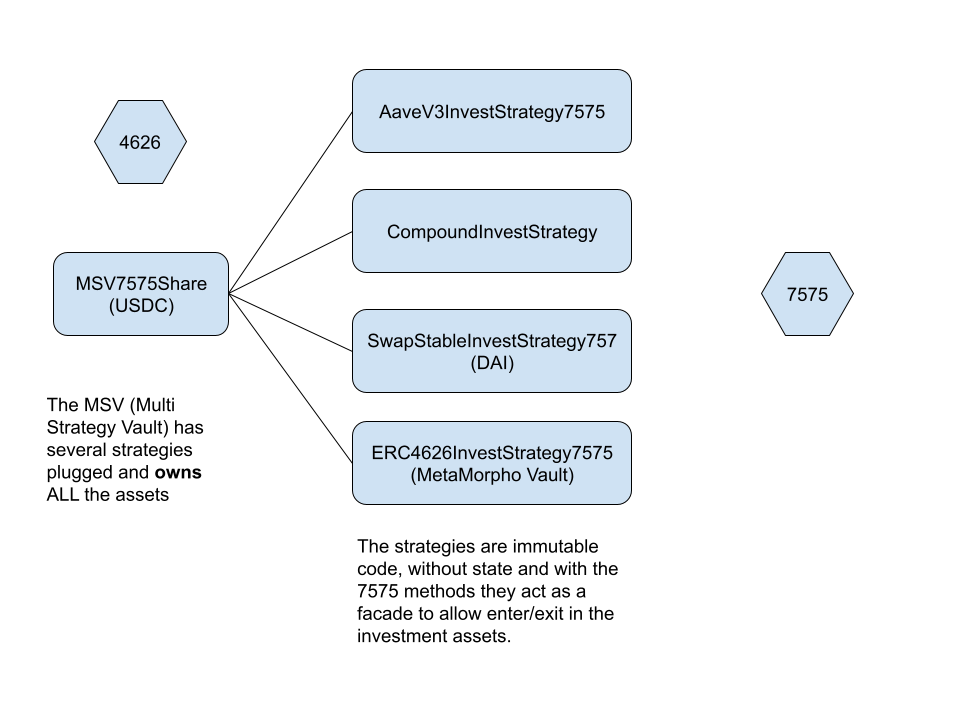

# MultiStrategyVault with 7575 endpoints

## Context

The [MultiStrategyVault (MSV)](https://github.com/ensuro/vaults/blob/main/contracts/MultiStrategyERC4626.sol) is a contract developed by Ensuro for its internal needs of asset management.
It allows plugging different strategy contracts into the vault, which will invest the asset in various ways.
These strategies' code is executed in the context of the vault (using delegatecall), in this way, the investment assets are owned by the main vault which is better for governance and transparency.

## Summary

In this project, I will extend the MSV to make it compatible with the ERC-7575.
The strategy contracts, previously meant just as code extensions of the core vault, will now become entry points that accept calls to enter or exit using directly the investment assets.
This will keep the extensibility of the MSV, and the same asset ownership (the invest assets will still be owned by the MSV),
but will provide new endpoints that can be used for efficiency and practicality.

## Presentation

https://www.loom.com/share/b369e6de5d9340f8b9e90602031632f9?sid=b9da65a7-a60c-4151-be7d-bca984b01785

## Feature achieved

The MultiStrategyVault is a 4626 vault that accepts multiple pluggable strategies to invest in different ways.

Typically those strategies have ERC20 assets representing the investment, like AAVE's aTokens.

In this project we extend the strategies to support the 7575 standard, allowing to enter and exit the vault directly with the investment tokens.

Also, I implemented a new strategy that invests in other 4626 tokens (denominated in the same asset as the MSV asset) and with the 7575 support, it's possible to enter and exit in those 4626 shares.

Strategies supported:

- AaveV3InvestStrategy7575: invest in AAVE
- CompoundV3InvestStrategy: invest in Compound (also collects rewards). Couldn't port it to 7575 because of lack of time, but should be easy.
- StableSwapInvestStrategy7575: invest in other token that can be swapped at a stable price (minus slippage) for the asset price. It can be used to invest in other stablecoins that generate yield like USDM.
- ERC4626InvestStrategy7575: invest in other 4626 vaults, like MetaMorpho vaults.

The main feature of this design is this allows to have a flexible vault with pluggable strategies, but keeping the ownership of the assets in the core vault, something that's better for security and transparency reasons.

## Architecture

## Pain points

In the initial design of the MultiStrategyVault, I decided to use the same method names as the ones used in the 4626 standard in the strategies, to make it easier to associate the expected behaviour.

But when those strategies also have to support the 7575 standard that also has the same method names but with different parameters or different semantics, that generates some problems and makes the code hard to understand.

In the future it would be good to change the IInvestStrategy interface to use different names.

## Libraries used

- https://www.npmjs.com/package/@ensuro/vaults
- https://www.npmjs.com/package/@ensuro/swaplibrary
- https://www.npmjs.com/package/@ensuro/ensuro: just utils functions, not the Ensuro protocol

## EVM Address

0x4d68Cf31d613070b18E406AFd6A42719a62a0785

## Contact

https://x.com/gnarvaja
