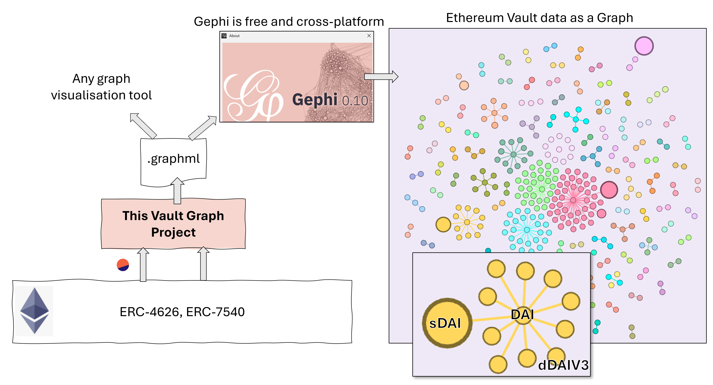
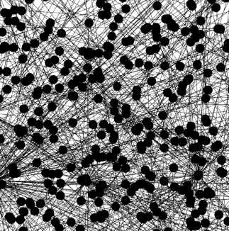

- [1. Project: Vault Graph](#1-project-vault-graph)
- [2. Summary](#2-summary)
- [3. Competition Requirements](#3-competition-requirements)
  - [3.1. Presentation](#31-presentation)
  - [3.2. Features](#32-features)
  - [3.3. Architecture](#33-architecture)
  - [3.4. Pain Points](#34-pain-points)
  - [3.5. Libraries](#35-libraries)
- [4. Quick Start](#4-quick-start)
  - [4.1. Option A: Use Preprepared Gephi File](#41-option-a-use-preprepared-gephi-file)
  - [4.2. Option B: Use Repo to rebuild files](#42-option-b-use-repo-to-rebuild-files)
    - [4.2.1. Setup Repo](#421-setup-repo)
    - [4.2.2. Prepare Data](#422-prepare-data)
    - [4.2.3. Open GraphML in Gephi](#423-open-graphml-in-gephi)
- [5. Data Processing Detail](#5-data-processing-detail)
  - [5.1. Step 1: Fetching Data from Dune Analytics (`s10_getDuneQueryDataAll.ts`)](#51-step-1-fetching-data-from-dune-analytics-s10_getdunequerydataallts)
  - [5.2. Step 2: Retrieving and Enriching Vault Data (`s20_getVaultDataAll.ts`)](#52-step-2-retrieving-and-enriching-vault-data-s20_getvaultdataallts)
  - [5.3. Step 3: Building the GraphML File (`s30_buildGraphML.ts`)](#53-step-3-building-the-graphml-file-s30_buildgraphmlts)
- [6. Contact](#6-contact)
  - [6.1. EVM Address](#61-evm-address)
  - [6.2. Telegram](#62-telegram)

# 1. Project: Vault Graph
For the Tokenized Vault Competition @ ETHCC. The unique submission name is `Vault Graph`. The project was started July 6th [see full commit history](https://github.com/KevinSmall/vault-bounties/commits/main/).

# 2. Summary
Vault meta-data can be represented as a graph with `vault assets` and `vaults` as graph **nodes**. Graph **edges** connect these nodes and show which vaults use which assets. 

This repo prepares a graph data `.graphml` file of Ethereum mainnet vault meta-data. This file can then be visualized in external graphing tools such as Gephi, where various analyses can be done. For example, the sizes of vault nodes can be scaled to represent the TVL of that vault, or vault nodes can be coloured according to the asset they contain. See the [quick start](#4-quick-start) section below on how to use this repo.

But why do this? The idea is that graphs can reveal things about a dataset (in this case the landscape of deployed vaults) that isn't easy to see from regular tabular views or charts.

# 3. Competition Requirements
## 3.1. Presentation
Click the image below to watch the presentation. Be sure to set quality to 4K. The YouTube link is `https://www.youtube.com/watch?v=-EgRMKv5gBM`.

[](https://www.youtube.com/watch?v=-EgRMKv5gBM)

## 3.2. Features
Extracts vault data from Ethereum mainnet and produces a `.graphml` file of vault meta-data.

## 3.3. Architecture
The project is written in TypeScript with some Dune SQL. Project overview:



## 3.4. Pain Points
- Not being able to easily tell what vault type a particular contract is, or even if it is a vault at all and not just looking like one. Is it just plain ERC-4626, or is it async or multi-asset? From [discussion in ERC-4626 telegram](https://t.me/erc4626alliance/886) a [new ERC was suggested](https://hackmd.io/@7vPFDCt9QlGz6m05ME7LCw/rksrD1sw0) that could help for future ERCs.
- Not having enough time. The Dune data download step downloads pre-run datasets from Dune. With more time these datasets could be prepared on demand.

## 3.5. Libraries
This repo uses Yarn, Hardhat, Dune Analytics Client SDK, some libraries for CSV files. Tests use Mocha and Chai.

# 4. Quick Start
Gephi is a free cross-platform desktop application for graph analysis. Whichever option you choose below, you'll need to install [Gephi](https://gephi.org/) if you want to see the visualisation. Gephi isn't super intuitive to use. Watch [this excellent tutorial](https://www.youtube.com/watch?v=371n3Ye9vVo) to get an introduction on how to layout a graph, run analyses on it, and format it.

To get started, you have two options:

**Option A)** Open a pre-prepared `.gephi` file straight away in Gephi.

**Option B)** Install repo, run the data extract process, import the `.graphml` file to Gephi, format it, save it is a `.gephi` file.

## 4.1. Option A: Use Preprepared Gephi File
1. Open Gephi.
2. From Gephi, open this file: `/docs/vault-graph.gephi`. This represents Ethereum mainnet vaults, extracted July 2024, that had more than 10 deposit events in the last 6 months. Around 400 vaults are present.
3. The layout you see contained in the above file is the same one that was used in the [presentation](#31-presentation).

## 4.2. Option B: Use Repo to rebuild files

### 4.2.1. Setup Repo
1. Clone the repo.
2. Install
```
yarn install
```
3. Compile
```
yarn hardhat compile
```
4. Prepare env vars. Copy `env.template` to `.env` and enter your RPC provider URL and [Dune](https://dune.com/home) API key.
5. Check process runs with a small amount of data:
```
$ yarn run:sample
```

```
Running in sample mode...
Fetching data from Dune Analytics...
Done.
Reading CSV files...
Done.
Reading chain to get vault data...
Processed 0xd9a442856c234a39a81a089c06451ebaa4306a72
Skipping 0x61dc14b28d4dbcd6cf887e9b72018b9da1ce6ff7 because it is missing functions and so not a proper ERC-4626 vault.
Processed 0xea1a6307d9b18f8d1cbf1c3dd6aad8416c06a221
Done.
Writing results...
File written to ./src/data/process/vaults-sample.csv
Preparing GraphML file...
File written to ./src/data/out/output-sample.graphml
Done.
All steps completed.
Done in 5.32s.
```

### 4.2.2. Prepare Data

To run process for all data:
```
$ yarn run:full
```
After around 10 minutes, a `.graphml` file is written.

### 4.2.3. Open GraphML in Gephi
When the file is first opened it normally looks like a "hairball".



It needs formatted to look nice, as explained in [this Gephi tutorial](https://www.youtube.com/watch?v=371n3Ye9vVo).

# 5. Data Processing Detail
This section covers the nitty-gritty of what happens during TypeScript processing when you `yarn run:full`.

## 5.1. Step 1: Fetching Data from Dune Analytics (`s10_getDuneQueryDataAll.ts`)

This script fetches data from the Dune Analytics platform using specific query IDs. It retrieves the results of these queries and saves them as CSV files. The data includes information about asset prices and vault addresses. Asset prices is a straight dump of all ~1000 records. The (potential) vault addresses are selected by looking for contracts that emitted more than 10 deposit events in the last 6 months. Some of the contracts will turn out to be not vaults, and will be discarded later.

Ideally these queries would re-execute each time they are accessed, but I ran out of time. This step just downloads the last execution of the query.

**Dune Queries:**
Copies of the Dune queries are below. Links to the Dune queries and their IDs are at the top of each file:
- Query Vaults: `/src/scripts/dune/dune-analytics-query-vaults.sql`
- Query Prices: `/src/scripts/dune/dune-analytics-query-prices.sql`

**Key Actions:**
- Connects to Dune Analytics using your API key.
- Accesses last query run to fetch data on asset prices and (potential) vault addresses.
- Saves the fetched data to CSV files for further processing.

## 5.2. Step 2: Retrieving and Enriching Vault Data (`s20_getVaultDataAll.ts`)

This script takes the vault addresses and retrieves detailed information about each vault, such as symbols, names, asset details, and total assets. It enriches the initial data set with these details and saves the updated information to a CSV file.

**Key Actions:**
- Reads vault addresses from CSV file.
- Fetches detailed data for each vault using blockchain interactions.
- Enriches the vault data with additional attributes like symbols, names, asset details, and total assets.
- If any function to retrieve extra data fails, then the contract isn't a proper vault, and the address is discarded.
- Saves the enriched data to a CSV file for use in the GraphML generation and other analyses.

## 5.3. Step 3: Building the GraphML File (`s30_buildGraphML.ts`)

This script processes the vault data CSV to build a GraphML file, which represents the relationships between vaults and assets in a graph structure. The GraphML file can be used for visualizing the vault-asset network.

**Key Actions:**
- Reads the vault data from CSV file.
- Constructs nodes and edges representing vaults and assets.
- Creates a GraphML file with the structured data.

# 6. Contact
## 6.1. EVM Address
`kevinsmall.eth` (`0xD30b6ccAD6de9b9B9CC4e78A2570aa81000EAcaC`)

## 6.2. Telegram
[@beringelar](https://t.me/beringelar)
