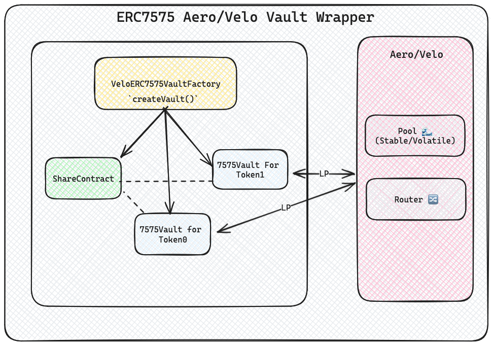

# Velodrome ERC7575 Vault Wrapper 

## Summary
This repo contains [ERC7575](https://eips.ethereum.org/EIPS/eip-7575) vault wrapper contracts for Velodrome V2 liquidity pools (stable and volatile) to enable multi-asset deposits and withdrawals. It is an extension of ERC4626 Vault standard to support multiple assets or entry points for the same share token. This also enables Vaults which don’t have a true share token but rather convert between two arbitrary external tokens.

> This is a submission for [4626 Alliance Hackathon Competition!](https://x.com/erc4626/status/1808141681805422754) 🎉

**Key features:**
- Factory contract ([VelodromeERC7575VaultFactory.sol](../velodrome-7575-wrapper/src/VelodromeERC7575VaultFactory.sol)) to easily deploy the share token and vault contracts for any Velodrome pool.
- [Share token (ERC20) contract](../velodrome-7575-wrapper/src/VelodromeERC7575Share.sol) for the V2 Pools. 
- Two [vault contracts](../velodrome-7575-wrapper/src/VelodromeERC7575Vault.sol) per pool - one for `token0` and one for `token1`
- Handles all the swapping and liquidity provision logic internally in the vault contracts.
- Supports both stable and volatile pools.

> [!IMPORTANT]
> The wrapper implementation should work for basic [Aerodrome](aerodrome.finance) pools as well as both follow the same implementation (fork).


## Features Achieved
- [x] ERC7575-compliant wrapper contracts for Velodrome/Aerodrome pools
- [x] Factory contract for easy deployment of wrapper and share contracts.
- [x] Support for both stable and volatile pool types.
- [x] Fork tests.
- [x] Deployment and vault creation scripts.

> [!TIP]
> Volatile pools use `x.y=K` curve <br/>
> Stable pools use `x^3.y + y^3.x=K` curve


## Testing and deployment:
- **Install dependencies:**
```sh
forge install
```

- **To run all the tests**:
```sh
forge test
```

- **To deploy the Factory**:
```sh
forge script ./scripts/DeployVelodromeERC7575VaultFactory.s.sol --rpc-url <RPC_URL> --broadcast

# Output:
# ...
# VelodromeERC7575VaultFactory deployed at: <FACTORY_ADDRESS>
# ...
```

Once the factory contract is deployed, you can create new WrapperVaults for the pools via the `CreateVault` [script](./scripts/CreateVault.s.sol):
- Update the factory contract address in the script.
- Replace the `token0`, `token1` and `poolAddress` fields in the script.
- Run:
```sh
forge script ./scripts/CreateVault.s.sol --rpc-url <RPC_URL> --broadcast
```
- The address of vault and share contracts will be printed.

## Architecture



**1. Share Token Contract**
 - ERC20 token representing ownership of liquidity in the pool.
 - Minted to users upon deposit and burned during withdrawals.
 - Separate share token deployed for each pool.

**2. Vault Contracts (x2)**
 - Implements ERC4626 methods and events excluding ERC20 methods and events. 
 - Deployed for each of the two tokens in the pool (`token0` and `token1`)  
 - Handle deposits by swapping half the assets to the other token and adding liquidity.
 - Enable withdrawals by removing liquidity and swapping assets back to the original token
 - Mint and burn share tokens during deposits and withdrawals.

**3. Factory Contract**
 - Facilitates deployment of share token and vault contracts
 - Called with the addresses of the two tokens and the pool to deploy wrappers for
 - Returns the addresses of the newly deployed share token and vault contracts

**Usage**:
1. Deploy the factory contract.
2. Call the `createVault()` method to deploy wrappers for each desired pool.
3. Direct user deposits and withdrawals to the vault contracts based on the `asset`.

## Pain Points
- No/very minimal reference implementation. 
- Handling both stable and volatile pools required additional logic and checks.
- Finding the optimal split of assets to swap before adding liquidity was tricky to implement.
- Dust issue when swapping/depositing to pools. 

## Libraries Used
- Solmate (https://github.com/transmissions11/solmate)
- Forge Standard lib (https://github.com/foundry-rs/forge-std)

## EVM Address
- `0x89e357484BD97B489a291681789fd259C8dc71d1`

## Contact
- Twitter: https://x.com/0xasp_

## Future improvement ideas:
- More robust methods to calculate amounts to add liquidity.
- Make current implementation is resistant to pool manipulation attacks.
- Extend support for Concentrated pools (Slipstream).
- More tests.

--- 

***Disclaimer**: This project is for educational and demonstration purposes only. The contracts are not production ready. Use at your own risk; the authors are not liable for any losses or damages resulting from the use of this software.*